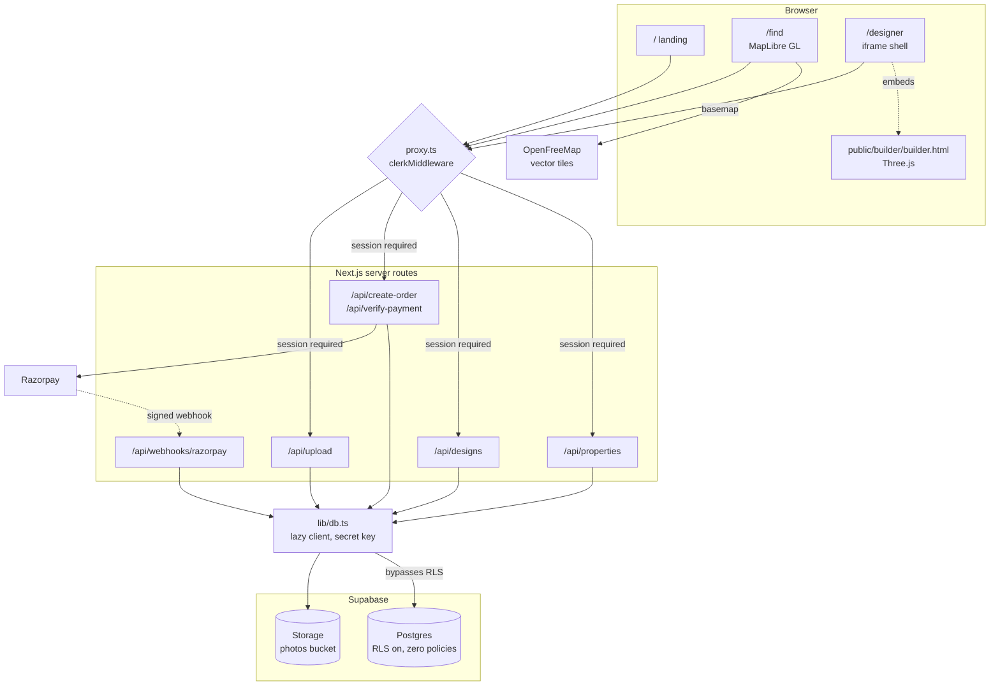
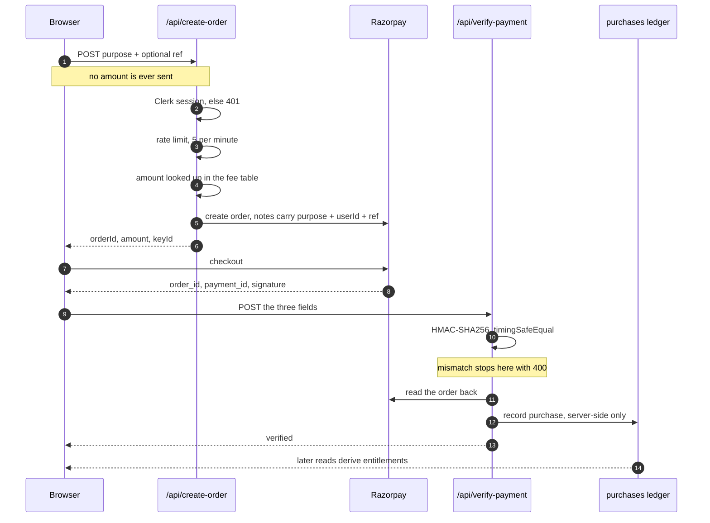

<div align="center">

# ArchIt

**Find a property on a 3D map, then design the house that goes on it — in the browser.**

[**Live app →**](https://archit.chaudharyankit.in)

[](https://github.com/ankit1324/ArchIt/actions/workflows/ci.yml)
[](LICENSE)
[](https://nextjs.org)
[](https://www.typescriptlang.org)

</div>

---

Most property sites hand you a photo gallery and a floor plan drawn in 2004. ArchIt
puts listings on a real 3D basemap you can fly through, and then lets you build the
house on the plot you just looked at — massing, roofs, materials, lighting — without
installing anything.

## What's in it

| Surface | Route | What it does |
| --- | --- | --- |
| Landing | `/` | Marketing page and demo reels for the suite |
| **Find** | `/find` | 3D map property search — pan, tilt, filter by type, price, beds, area. Listings render as extruded buildings on the basemap. |
| **Designer** | `/designer` | Browser house builder. Place a plot, stack floors, cut openings, apply materials, save designs to your account. |

The [live app](https://archit.chaudharyankit.in) is the fastest way to see it. Find
and Designer sit behind a session, so they return 404 rather than a redirect when you
are signed out — that is `auth.protect()` declining to leak which routes exist.

## How it fits together



Every arrow into Postgres goes through a server route holding the secret key. There
is no path from the browser to the database, which is why RLS can stay deny-all.

## Stack

- **[Next.js 16](https://nextjs.org)** (App Router, Turbopack) + React 19 + TypeScript
- **[MapLibre GL](https://maplibre.org)** 5.x with [OpenFreeMap](https://openfreemap.org) tiles — no map vendor key
- **[Three.js](https://threejs.org)** 0.160 for the designer, served as a standalone
  page in `public/builder/` and embedded as an iframe
- **[Supabase](https://supabase.com)** — Postgres for listings, designs, and the
  purchase ledger; Storage for listing photos
- **[Clerk](https://clerk.com)** for auth
- **[Razorpay](https://razorpay.com)** for payments
- **Tailwind CSS 4**
- Tests on `node --test`, no test framework dependency

## Design decisions worth calling out

**The server owns every price.** Clients send a *purpose*, never an amount.
[`lib/fees.ts`](lib/fees.ts) is the single source of truth, in paise:

```ts
contact_owner:     5000   // ₹50   — unlock owner contact details
featured_property: 25000  // ₹250  — one-time boost per listing
builder_unlock:    200000 // ₹2000 — one-time per user, full builder suite
template_unlock:   9900   // ₹99   — one-time per template
```

A tampered request body cannot buy a ₹2000 unlock for ₹1, because the amount is
never in the body to begin with. Entitlements are derived from the purchase ledger
rather than trusted from the client — including whether a listing is `featured`.



The amount is read from the fee table *after* the session check, and the purchase is
written only after the signature verifies — so a client can choose what it is buying,
never what it costs or whether it succeeded.

**Row Level Security is deny-all on purpose.** Every table has RLS enabled and
zero policies, so the anon and publishable keys can read nothing. All data access
goes through server routes holding the secret key, which stamp `user_id` from the
Clerk session and never from the request body. The one deliberate exception is the
`photos` storage bucket: public reads (they are public URLs anyway), writes only
through the upload route.

**The Supabase client is lazy.** `next build` evaluates every route module to
collect page data, so a client constructed at import time fails the build on any
machine without secrets. [`lib/db.ts`](lib/db.ts) defers construction to the first
real query behind a `Proxy`.

## Running it locally

Node **22.18+** is required — the test files import `.ts` modules directly and rely
on Node's native type stripping. The version is pinned in [`.nvmrc`](.nvmrc).

```bash
git clone https://github.com/ankit1324/ArchIt.git
cd ArchIt
npm ci
cp .env.example .env.local   # then fill it in
npm run dev
```

Open [http://localhost:3000](http://localhost:3000).

### Environment

| Variable | Needed for |
| --- | --- |
| `NEXT_PUBLIC_SUPABASE_URL` | Supabase project URL |
| `NEXT_PUBLIC_SUPABASE_PUBLISHABLE_KEY` | Supabase browser client |
| `SUPABASE_SECRET_KEY` | Server routes; bypasses RLS, never expose |
| `NEXT_PUBLIC_CLERK_PUBLISHABLE_KEY` | Clerk browser client |
| `CLERK_SECRET_KEY` | Clerk server verification |
| `RAZORPAY_KEY_ID` | Checkout |
| `RAZORPAY_KEY_SECRET` | Order creation and payment verification |
| `RAZORPAY_WEBHOOK_SECRET` | Webhook signature verification |
| `CRON_SECRET` | Authorizes `/api/keepalive`; the endpoint 401s without it |

### Database

Migrations are plain SQL in [`supabase/migrations/`](supabase/migrations), applied
with the [Supabase CLI](https://supabase.com/docs/guides/cli):

```bash
supabase db push
```

## Layout

```
app/                  routes — pages and API handlers
  api/                properties, designs, templates, payments, webhooks
  find/               3D map property search
  designer/           house builder shell
components/           React UI
lib/                  db, fees, payment validation, entitlements, types
public/builder/       standalone Three.js builder, iframed by /designer
public/demo/          demo reels
supabase/migrations/  schema, forward-only
tests/                node --test suites
```

## Scripts

```bash
npm run dev      # dev server
npm run build    # production build
npm run lint     # eslint
npm test         # node --test
npx tsc --noEmit # type check
```

## Contributing

Pull requests welcome. `main` is protected by a
[ruleset](.github/rulesets/README.md): PRs only, `build-and-test` must pass and be
up to date with `main`, review threads resolved, squash merges, linear history.

CI runs type check, lint, tests, and a production build on every PR.

## License

[MIT](LICENSE) © Ankit Chaudhary
